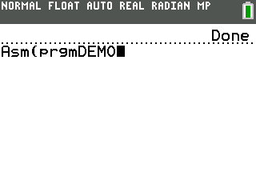
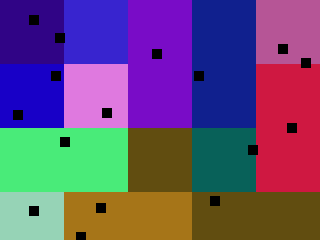

## Recursive Rendering Voronoi Demo

Draws a simple rasterized voronoi graph rendered with progressive refinement until the native resolution of the screen is reached.

Written to run on the TI-84 Plus CE graphing calculator.

### Output

Running the program

Time-constant frames

### Downloading and Running

1. Download the latest release from the releases tab
2. Download the latest release of CLibs from [here](https://github.com/CE-Programming/libraries/releases/latest)
3. Upload `DEMO.8xp` and `clibs.8xg` to your calculator
4. Run `asm(prgmDEMO)`

### Building

Requires the [CE C/C++ Toolchain](https://github.com/CE-Programming/toolchain)

make using `cedev.bat`
